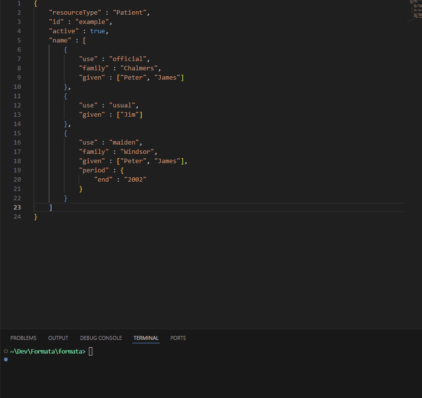

# Stof

[Stof](https://stof.dev) is a unified data interface and interchange format for creating, sharing, and manipulating data. As a data format, it can replace other interchange formats like JSON, TOML, YAML, etc... As a data interface and runtime, it can remove the fragile and cumbersome parts of combining and using data from your application.

Stof documents are simple, scalable, portable, and efficient. By turning data into a sandboxed and embedded runtime, Stof is capable of performing logic and transformations with your data anywhere you need them, saving countless hours of development and headache. Read the [docs](https://docs.stof.dev) to learn more about what you can do with Stof.



## Resources
- [Docs](https://docs.stof.dev)
- [Discord](https://discord.gg/Up5kxdeXZt)
- [Contact Us](https://stof.dev/contact-us)
- [More Information](https://docs.stof.dev/resources-and-information)

## Adding Stof to your Project
### Rust
```bash
cargo add stof
```
### TypeScript (JSR)
[Stof JSR](https://jsr.io/@formata/stof)

We're adding languages and ways to use Stof all the time - please reach out if interested.

## Example
> For declaring data, Stof is a superset of JSON - valid JSON will always be valid Stof.
``` rust
users: [
    {
        name: "Joe Schmo",       // commas or semi-colons accepted, but optional
        cm height: 6ft + 1in     // Stof adds units and declarations are expressions
        age: +32;                // trailing commas or semi-colons are okay
    },                           // trailing commas in arrays are okay
]

fn getJoe(): obj {               // Stof adds data types (casting, etc..)
    for (user in self.users) {
        if (user.name.toLower().contains("joe")) return user;
    }
    return null;
}

#[main]
fn main() {
    let joe = self.getJoe();
    pln(stringify(joe, 'toml')); // any format loaded into the doc (parse too)
}
```
``` bash
> stof run example.stof
age = 32
height = 185.42
name = "Joe Schmo"
```

## Why Use Stof?
### Accessibility & Unification
Simplify data access, making it more straightforward to interact with diverse data sources and destinations. Stof works with other data formats instead of competing, meaning no matter what data format or schema you're interfacing with, Stof can help.

### Logic as Data
Add custom logic to Stof documents, leveraging their data for a more capable and robust data interface. Offer a safe way to send logic over the network, tying systems together at the data layer.

### Validation
Ensure integrity by validating data using schemas, defined in Stof, reducing errors and maintaining consistency across applications.

### Transformation & Structure
Dynamically manipulate data, enabling seamless transformations to meet specific application needs, such as converting units or restructuring data formats.

### Orchestration
Stof is a logical layer between data sources and applications, capable of unification, transformation, validation, structuring, access control, and orchestration between systems, replacing fragile application code typically responsible for these tasks.

## Contributing
Take a look first at the Stof test suite in `src/tests/tests.stof`, this will give a good jumping off point, but there's a lot to do still overall. We'll update this section as the project progresses with more details on how you can specifically get involved.

There are lots of opportunities to contribute and use Stof. If you have ideas or want to get involved, just reach out and we'll make it happen.

## License
Apache 2.0. See LICENSE for details.
